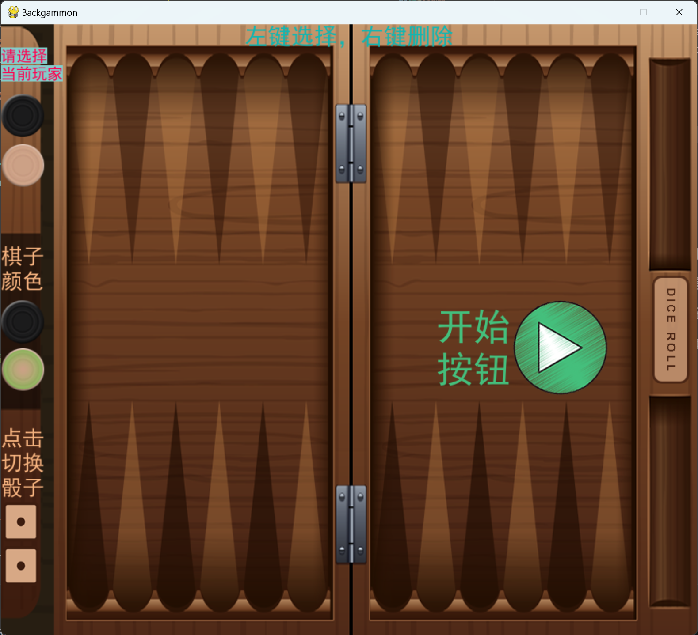

# 基于 Expectiminimax 的西洋双陆棋博弈

### 西洋双陆棋规则简介
看完这两个基本上能了解个大概了

[规则介绍 by bilibili@夏枫Nuster](https://www.bilibili.com/read/cv13667392/)

[实战演示 by bilibili@瑞成男中音](https://www.bilibili.com/video/BV14D4y197By/)


## 本项目实现功能
1. 使用 `pygame` 实现图形化界面，用来输入当前棋盘状态与展示计算结果，使用了 [alexandremartens](https://github.com/alexandremartens) 的 [Backgammon](https://github.com/alexandremartens/Backgammon) 项目的图片作为资源 (backgammon.py) ；
   
2. 使用带 Alpha-beta 剪枝的 Expectiminimax 算法进行计算，在达到最大深度后对当前状态进行评估，以限定搜索深度，大部分代码实现来自 [chanddu](https://github.com/chanddu) 的 [Backgammon-python-numpy-](https://github.com/chanddu/Backgammon-python-numpy-) 项目 ~~（但貌似他并没有用到numpy~~ (expectiminimax.py) ；

3. 使用 `graphviz` 画出博弈树 (draw_tree.py) 。
   

## 安装
```
    pip install pygame==2.5.2
    pip install graphviz==0.20.3
```
python 版本：3.9

项目已自带 `Graphviz-11.0.0-win64` （请在解压到当前文件夹下），且会自动设置环境变量，无需单独安装


## 详细使用说明

### 1. 输入棋盘状态

(1). 在本项目文件夹下使用 ``python backgammon.py`` 启动；




(2). 选择当前行动玩家；

(3). 左键单击添加棋子，右键单击移除棋子，堆、槽、中间横杆均可放置；

(4). 左侧骰子，左键单击+1，右键单击-1，点击右侧 `DICE ROLL` 可随机掷骰子；

(5). 点击开始即可计算

### 2. 展示博弈树
    
计算结束后自动展示博弈树图，同时保存到当前路径下的 Expectiminimax-Tree.gv.png 
    
由于博弈树较大，计算以及绘制时间可能较长

```
       绿色正三角: max节点
       橙色倒三角: min节点
       黄色圆形:   chance节点(计算期望值)
       蓝色矩形:   终止节点(使用eval_fn对当前状态进行评估)
       红色星形:   代表其之后的子叔被 Alpha-beta 剪枝掉了
```

### 3. 结果展示
   

```
    红色虚线：原来位置
    红色实现：移入位置
    蓝色虚线：吃掉对手
    蓝色实线：被吃放到横栏上
```

## 一些实现细节
    
1. 使用 `pygame` 中 `Rect` 对象对每个交互元素进行定位，通过 `Rect.collidepoint(event.pos)` 来判断鼠标点击时是否在该 `Rect` 对象中

2. 评估当前状态的函数可仔细看下 expectiminimax.py 中 `eval_fn` 函数，好像还可以用神经网络来学习 ~~但本菜鸡一时半会也搞不出来~~

---
### Others

搞这玩意主要是博弈论期末要整个应用博弈论的项目  ~~本来就没听懂几节课，幸好不是考试~~

讨论半天加上参考前人学长的项目最终决定把《人工智能原理》课中学过的和博弈论看起来占点边的 minimax 拿来搞，又找来找去找到书上这个西洋双陆棋 ~~(应该没有学长搞过这门冷门的东西吧)~~

最后，非常感谢 [alexandremartens](https://github.com/alexandremartens) 、[chanddu](https://github.com/chanddu) 等大佬的开源项目和教程，本人第一次自己亲手写这么长的代码(虽然 expectiminimax.py 主要还是copy chanddu 大佬的)，如果有哪里不妥当的，请多包涵
